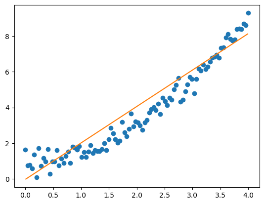

### 1. Short Answers

1. The time needed to evaluate one test image is O(N\*d) since N O(d) computations are needed to find the nearest neighbor. The total testing-time complexity over M test images is therefore **O(N\*M\*d)**.

2. The 10-nearest neighbor model should get a smoother boundary, since it is less sensitive to individual data points and is more robust to outliers.

3. *w*=[0,1], *b*=0.

4. The largest Eigenvalue of $A^{T}A$ equals to the square of the largest singular value.

5. Naive Bayes assumptions assume the features of a label are independent, which is not true in applications such as language processing, where observed words are not independently generated but dependent on each other according to grammar.

### 2. Linear Regression

1. Since $X$ is full rank it is invertible. Therefore it always exists a $w=yX^{-1}$.

2. rank($\Sigma$) is equal to the rank of $X$, which is $n$.

3. Use SVD. $X=U\Sigma V^{T}$; write $X X^{T}$ as $U \Sigma V^{T}  V \Sigma^{T} U ^{T} = U \Sigma \Sigma^{T} U ^{T}$, which is invertible since:
    1. Because $X$ is full-rank, $\Sigma$'s diagonal should be non-0, therefore invertible;
    2. $U^{T}U = I$.
Thus $XX^{T}$ is invertible.

### 3. SVM

1. At least $d+1$ support vectors is needed to determine the margin and the decision boundary.

2. The smallest number of support vectors is 3, since each non-0 element in the Lagrangian vector should correspond to at least one support vector. The largest possible number of support vectors is equal to the demension $d$ of the problem, since every datapoint is potentially a support vector in some solutions of the dual problem, the number of which unbounded.

3. - a. $\phi (x) = [1,\sqrt{2}x_1,\sqrt{2}x_2,x_1^2,x_2^2,x_1x_2]^T$

    - b. $ \bm{w} = [0,0,0,0,1]^T$

### 4. Gaussian Naive Bayes

1. Bayes rule gives $P(y=1|\bm{x}) = \frac{P(y=1)P(\bm{x}|y=1)}{P(\bm{x})}=\frac{P(\bm{x}|y=1)p}{P(\bm{x}|y=1)p+P(\bm{x}|y=-1)(1-p)}$, which is

\[1/(\frac{P(\bm{x}|y=1)p+P(\bm{x}|y=-1)(1-p)}{P(\bm{x}|y=1)p}) \\
=(1+\frac{(1-p)P(\bm{x}|y=-1)}{P(\bm{x}|y=1)p})^{-1} \\ 
= (1+exp(log(\frac{A}{B})))^{-1}
\]

where $A = P(\bm{x}|y=-1)(1-p),B=P(\bm{x}|y=1)p$.

2. Under the given distribution 
$A =(1-p)\prod_{j} (1/\sqrt{2\pi}) exp(\frac{-(x_j-\mu_{-,j})^2}{2})$, $B =p \prod_{j} (1/\sqrt{2\pi}) exp(\frac{-(x_j-\mu_{+,j})^2}{2})$

Thus 
\[
log(A/B) 
\\
\\
= log(\frac{(1-p)exp(-\frac{1}{2}\sum_j(x_j-\mu_{-,j})^2)}{(p)exp(-\frac{1}{2}\sum_j(x_j-\mu_{+,j})^2)})
\\
\\
=log(\frac{1-p}{p})-\frac{1}{2}\sum_j((x_j-\mu_{-,j})^2-(x_j-\mu_{+,j})^2)
\\
\\
=\sum_j(x_j(\mu_{-,j}-\mu_{+,j}))-\frac{1}{2}\sum_j(\mu_{+,j}^2+\mu_{-,j}^2)+log(\frac{1-p}{p})\] 

which is exactly in the form of $\bm{w}^T\bm{x}+b$, with
\[\bm{w}=\bm{\mu_-}-\bm{\mu_+}, b = -\frac{1}{2}\sum_j(\mu_{+,j}^2+\mu_{-,j}^2)+log(\frac{1-p}{p})\]

3. $P(y=1|\bm{x}) = \frac{1}{1+exp(\bm{w}^T\bm{x}+b)}$.

### 5. Linear Regression

